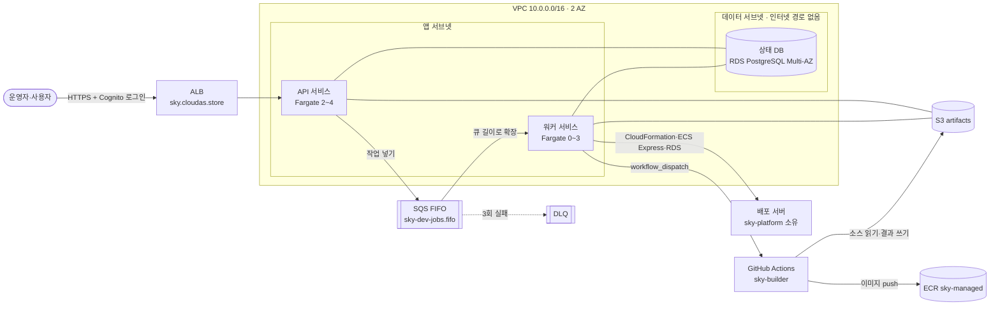
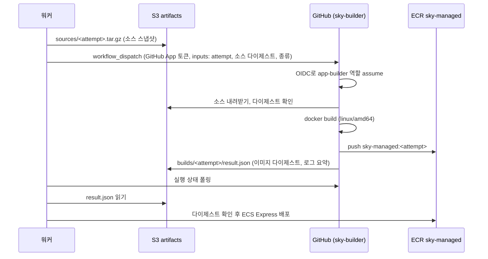

# B안 설계: Fargate API + 워커, RDS·S3·SQS

- 작성일: 2026-10-10
- 참고: `sky-infra-v0` `feat/service-structure`(A안), `docs/tasks/a-plan-infra.md` 2장, `docs/sky-task-role-actions.md` 6장
- 상태: 코드 작성과 정적 검사까지 끝남 (`fmt`, `validate`, mock plan 테스트, 검사 스크립트 단위 테스트). **apply한 적 없음**

## 1. 왜 B안인가

A안은 지금 코드를 그대로 올리는 1단계였다. 한계는 네 가지다.

| A안 한계 | 원인 | B안 해결 |
|---|---|---|
| 태스크를 1개만 띄울 수 있고, 배포할 때마다 중단된다 | 상태가 `.sky/` JSON 파일이고 flock으로 잠근다 | 상태는 RDS(Multi-AZ), 파일은 S3. API는 상태 없이 최소 2개 |
| 사용자 코드 빌드가 호스트 권한에 닿는다 | 태스크에 `/var/run/docker.sock`을 연결한다 | 빌드는 GitHub Actions(별도 저장소 `sky-builder`)가 한다. Fargate에는 Docker가 없다 |
| 긴 작업이 웹 요청 처리와 같은 프로세스에서 돈다 | 배포·DB 작업이 프로세스 안 스레드다 | 작업은 SQS로 워커에 넘긴다. 워커는 큐 길이에 따라 0~N개 |
| Sky가 장악되면 계정 권한을 넓힐 수 있다 | 사용자 앱 역할에 권한 경계가 없다 (A안 문서 6장) | 권한 경계를 강제한다 (5장) |

원칙은 A안과 같다. sky-infra와 sky-platform은 같은 AWS 자원을 동시에 관리하지 않는다.
- sky-infra 소유: 배포 서버 자원을 뺀 나머지 (네트워크, 서비스 서버, 상태 DB 등)
- sky-platform 소유: 배포 서버 자원 (ECS Express 서비스, 앱용 RDS, ECR `sky-managed`, `sky-core`·`sky-db-*` 스택)

## 2. 전체 구조



| 구성 요소 | 모듈 | A안 대비 |
|---|---|---|
| VPC, 서브넷 3계층, NAT(AZ별), 보안 그룹 | `network` | 재사용 + 워커 보안 그룹, 데이터 계층이 워커 접근도 받음 |
| Route 53(읽기), ACM, ALB, Cognito | `edge` | 재사용. 헬스 체크 기본값 `/health` |
| ECR `sky-platform` | `ecr` | 그대로 |
| Secrets Manager (OpenAI, GCP, GitHub App 키) | `secrets` | GitHub App 키 추가 |
| Fargate 클러스터 | `ecs-cluster` | 새로 (A안 `ecs`의 EC2·ASG·EFS 대체) |
| API·워커 서비스 | `ecs-service` ×2 | 새로. 같은 모듈을 설정만 바꿔 두 번 쓴다 |
| 상태 DB | `state-db` | 새로 (EFS `.sky/` 대체) |
| 파일 저장소 | `artifacts` | 새로 |
| 작업 큐 | `queue` | 새로 |
| IAM | `iam` | 역할을 API·워커로 나누고 권한 경계 추가 |
| GitHub OIDC 역할 | `github-oidc` | 재사용 + `app-builder` 역할 |
| 로그·알람 | `observability` | 재사용 + DLQ·큐 적체·DB 알람 |
| SSM 공개 출력값 | `published-outputs` | 재사용. 계약 버전 2 |

## 3. 구성 요소 설계

### 3.1 컴퓨트

API와 워커는 **같은 이미지**(`sky-platform:<SHA>`)를 쓰고 명령만 다르다. 이미지 태그는 `platform-image.auto.tfvars` 하나로 정해지므로 두 서비스가 항상 같은 버전이다.

| | API (`sky-dev-api`) | 워커 (`sky-dev-worker`) |
|---|---|---|
| 하는 일 | UI·API, 상태 조회, 작업을 큐에 넣기, GitHub 소스 폴링(리더 하나만) | 분석, 배포, DB 작업, 빌드 실행 요청 |
| 크기 | 0.5 vCPU / 1 GiB | 1 vCPU / 2 GiB, 임시 스토리지 50 GiB |
| 개수 | 2~4. ALB 대상당 요청 수(300/분) + CPU 60% 대상 추적 | 0~3. 큐 길이 단계 조정 |
| 배포 | 최소 100%, 최대 200% (무중단). 회로 차단기 롤백 | 같음. 처리 중인 태스크는 태스크 보호로 작업이 끝날 때까지 남는다 |
| 네트워크 | 앱 서브넷, `app` 보안 그룹 (ALB에서 8080만) | 앱 서브넷, `worker` 보안 그룹 (들어오는 연결 없음) |
| 비밀 주입 | GitHub App 키 | OpenAI 키, GCP 키, GitHub App 키 |

**워커 확장.** 태스크 0개에서는 "태스크당 대기 작업 수"를 나눗셈으로 구할 수 없어서 대상 추적 대신 단계 조정을 쓴다.
- 늘리기: 대기 메시지가 1개 이상이면 1분마다 +1(5개 이상이면 +2), 최대 3개까지
- 줄이기: 대기 메시지와 처리 중 메시지가 모두 0인 상태가 10분 이어지면 0개로
- 처리 중인 태스크는 워커가 ECS 태스크 보호(`$ECS_AGENT_URI/task-protection/v1/state`)를 켜 둔다. 그래서 축소나 이미지 배포 때 작업 중간에 끊기지 않는다.

**FARGATE_SPOT은 쓰지 않는다.** 클러스터에 등록은 해 두었다. 워커 작업이 중간에 끊겨도 이어서 할 수 있게 되면(7장 W5) 워커만 SPOT으로 바꿀 수 있다.

### 3.2 상태 DB (`state-db`)

- PostgreSQL 17, `db.t4g.medium`, Multi-AZ, gp3 20 GiB(최대 100 GiB까지 자동 확장), 암호화
- 데이터 서브넷에 두고, `data` 보안 그룹은 API·워커에서 오는 5432만 받는다. `rds.force_ssl = 1`로 TLS 접속만 허용한다.
- 백업 14일, 삭제 방지, 최종 스냅샷, Performance Insights
- 마스터 비밀번호는 RDS가 Secrets Manager에서 관리한다(`manage_master_user_password`). 그래서 비밀번호가 state에 남지 않는다.
- **비밀번호는 RDS가 주기적으로 교체한다.** 태스크 시작 때 환경변수로 주입하면 교체 후 새 접속이 실패한다. 그래서 비밀 ARN만 넘기고, 앱이 접속할 때(인증 실패 시 다시) Secrets Manager에서 읽는다(7장 P3).

나중에 할 일: 앱 전용 DB 사용자를 따로 만들거나 IAM DB 인증으로 바꿔서, 앱이 마스터 계정을 쓰지 않게 한다.

### 3.3 파일 저장소 (`artifacts`)

버킷 `sky-dev-artifacts-<계정>-<리전>`. 퍼블릭 차단, 버전 관리, SSE-S3, TLS 전용이다.

| 접두어 | 쓰는 쪽 → 읽는 쪽 | 보관 |
|---|---|---|
| `sources/` | 워커 → sky-builder | 30일 |
| `builds/` | sky-builder → 워커 | 30일 |
| `records/` | API·워커 (배포 기록, 분석 결과, 인증서) | 지우지 않음 |
| `tmp/` | API (업로드 중간 파일) | 7일 |

### 3.4 작업 큐 (`queue`)

`sky-dev-jobs.fifo`와 DLQ `sky-dev-jobs-dlq.fifo`로 구성한다. FIFO를 고른 이유는 두 가지다.
- `MessageGroupId = 앱 ID`: 같은 앱에 대한 배포·DB 작업이 동시에 돌지 않고 순서대로 처리된다. A안에서 앱별 잠금으로 하던 일을 큐가 맡는다.
- `MessageDeduplicationId = 시도 ID`: API가 재시도해도 같은 작업이 두 번 들어가지 않는다.

큐 설정은 다음과 같다.
- 가시성 시간 5분. 워커는 처리 중에 1~2분마다 `ChangeMessageVisibility`로 연장한다(최대 12시간).
- 3번 받고도 지워지지 않은 메시지는 DLQ로 간다. 워커가 죽은 경우도 여기에 포함된다. DLQ는 14일 보관하고 알람을 건다.

### 3.5 사용자 앱 빌드 (GitHub Actions)



- 빌드 러너는 GitHub 호스팅 러너(일회용 VM)다. 사용자 코드는 AWS 계정 안의 어떤 컴퓨트에서도 실행되지 않는다.
- `app-builder` 역할에는 `sky-managed` push, `sources/` 읽기, `builds/` 쓰기만 있다. 사용자 Dockerfile이 악의적이어도 다른 AWS 자원에 닿지 못한다.
- 마이그레이션 이미지와 복원 검사 이미지도 같은 워크플로가 만든다. 지금 sky-platform은 이 두 이미지를 로컬 `docker build`로 만든다.
- 소스를 S3에 한 번 올리는 이유가 있다. GitHub 소스든 업로드 소스든 빌드 입력이 하나로 통일되고, sky-platform이 이미 계산하는 `source_digest`로 무결성을 확인할 수 있다.

### 3.6 앞단과 네트워크

A안과 같다. 주요 사항만 다시 적는다.
- ALB 유휴 시간 300초. 리스너는 80→443 리다이렉트, 443은 Cognito 인증을 거쳐 API 대상 그룹(`ip` 타입)으로 보낸다.
- NAT는 AZ별로 하나씩 둔다. Fargate 태스크는 퍼블릭 IP 없이 NAT로 나간다. 행선지는 OpenAI, GitHub, GCP, AWS API다.
- S3 게이트웨이 엔드포인트가 있다. ECR·Logs·Secrets·SQS 인터페이스 엔드포인트는 넣지 않았다. NAT 비용이 부담되면 그때 추가한다.

## 4. 작업 흐름 예: 배포 요청

1. 사용자가 UI에서 배포를 누른다. API는 상태 DB에 시도(attempt)를 기록하고, `{type: deploy, application, attempt}`를 큐에 넣은 뒤 바로 응답한다.
2. 큐 적체 알람이 울려 워커가 0→1로 늘어난다. 첫 작업이 시작되기까지 1~2분 걸린다.
3. 워커는 메시지를 받으면 태스크 보호를 켜고 다음을 수행한다.
   - 단계마다 상태 DB에 체크포인트를 남긴다.
   - 소스를 S3에 올린다 → 빌드 워크플로를 실행한다 → ECS Express에 배포한다.
4. 끝나면 메시지를 지우고 태스크 보호를 끈다. 10분 동안 할 일이 없으면 워커는 0개로 줄어든다.
5. UI는 API를 통해 상태 DB의 진행 상황을 읽는다. 여러 API 태스크 중 어느 것이 받아도 같은 결과를 준다.

실패하면 메시지를 지우지 않는다. 가시성 시간이 지나면 다시 처리되고, 3번 실패하면 DLQ로 가서 알람이 울린다.
그래서 워커 작업은 같은 시도 ID로 다시 실행해도 안전해야 한다(멱등). sky-platform의 체크포인트(`aws_update_submitted` 등)가 이 역할을 한다.

## 5. IAM 설계

### 5.1 역할 목록

| 역할 | 맡는 주체 | 권한 요약 |
|---|---|---|
| `sky-dev-api-execution` | ECS (API) | ECR `sky-platform` pull, API 로그, GitHub App 키 주입 |
| `sky-dev-worker-execution` | ECS (워커) | ECR `sky-platform` pull, 워커 로그, OpenAI·GCP·GitHub App 키 주입 |
| `sky-dev-api-task` | API 프로세스 | 큐에 넣기, 상태 DB 비밀 읽기, artifacts 읽기·쓰기, ECS Exec |
| `sky-dev-worker-task` | 워커 프로세스 | 큐 소비, 태스크 보호, 상태 DB 비밀, artifacts, A안 Sky 태스크 권한에서 이미지 push를 뺀 것, 권한 경계 강제 |
| `sky-dev-infra-plan` | sky-infra PR | `ReadOnlyAccess` |
| `sky-dev-infra-apply` | sky-infra `dev` environment | `infra_apply_policy_arns`. 결정 0002 전까지 비어 있음 |
| `sky-dev-platform-deploy` | sky-platform `dev` environment (배포 브랜치는 main만) | ECR `sky-platform` 조회·push |
| `sky-dev-platform-release` | sky-infra main | state, 태스크 정의 등록, API·워커 서비스 UpdateService, 4개 역할 PassRole, refresh용 조회 |
| `sky-dev-app-builder` | sky-builder main | ECR `sky-managed` push, `sources/` 읽기, `builds/` 쓰기 |
| (런타임) `sky-core-*`, `sky-db-*` | 사용자 앱 | CloudFormation이 만든다. **권한 경계 `sky-dev-deployed-app-boundary`가 필수** |

### 5.2 A안의 권한 상승 경로를 막는 방법

A안 문서 6장에 남은 위험 두 가지가 있었다.
- Sky가 `sky-db-*` 역할에 임의의 인라인 정책을 쓸 수 있다.
- 그 역할을 태스크 정의에 넣어 RunTask하면, 그 권한으로 코드가 실행된다.

B안은 이렇게 막는다.

1. **권한 경계 강제.** 워커가 `sky-core-*`, `sky-db-*`에 대해 하는 아래 작업은 모두 `iam:PermissionsBoundary = sky-dev-deployed-app-boundary` 조건이 맞을 때만 허용된다.
   - `CreateRole`, `PutRolePolicy`, `AttachRolePolicy`, `DeleteRolePolicy`, `DetachRolePolicy`, `PutRolePermissionsBoundary`
   - 경계를 떼는 `DeleteRolePermissionsBoundary`는 명시적으로 거부한다.
2. **경계의 내용.** 템플릿이 붙이는 관리형 정책 두 개를 **조건까지 그대로** 옮기고, `rds!*` 비밀 읽기 하나를 더했다.
   - `AmazonECSTaskExecutionRolePolicy`: ECR pull, 로그 쓰기
   - `AmazonECSInfrastructureRoleforExpressGatewayServices`: ELB·보안 그룹·인증서·오토스케일링·알람·로그 그룹. 모두 `AmazonECSManaged=true` 태그가 붙은 자원으로 한정된다
   - `aws-postgres.json` 인라인 정책: `rds!*` 비밀 읽기

   조건을 함께 옮긴 이유: 액션만 옮기면(예: `elasticloadbalancing:*`) 장악된 역할이 Sky 자체 ALB 리스너를 고쳐 Cognito 로그인을 떼어 낼 수 있다. Sky 자체 자원에는 `AmazonECSManaged` 태그가 없으므로 경계 밖이다.
   IAM(서비스 연결 역할 생성 제외), STS, S3, RDS, Secrets 쓰기도 경계 밖이다. 그래서 인라인 정책에 `*:*`를 써도, 신뢰 정책에 외부 계정을 넣어도 실제 권한은 경계를 넘지 못한다.
3. **상태 DB 보호.** 워커의 RDS 권한 범위(`db:sky-*`)에 상태 DB(`sky-dev-state`)도 걸린다. 그래서 다음 작업은 명시적으로 거부한다. 스냅샷 복원 거부는 상태 DB 내용을 빼내는 경로를 막는 것이다.
   - 수정·삭제·재부팅·태그 변경
   - 스냅샷 생성과 스냅샷 복원
4. **역할 분리.** API는 AWS 배포 권한이 전혀 없다. 인터넷에 노출된 프로세스가 장악돼도 할 수 있는 일은 큐에 작업을 넣는 것뿐이다. 넣은 작업은 워커가 상태 DB의 시도 기록과 대조해 검증해야 한다(7장 W3).
5. **이미지 push 분리.** 워커는 `sky-managed`를 조회하고 정리만 한다. push는 `app-builder` 역할만 한다.

### 5.3 관리형 정책과의 대조

경계는 두 관리형 정책을 덮어야 한다. 빠진 것이 있으면 사용자 앱 배포가 `AccessDenied`로 실패한다.

**2026-10-10 대조 완료.** 기준은 `AmazonECSTaskExecutionRolePolicy` v1, `AmazonECSInfrastructureRoleforExpressGatewayServices` v6이다. 실제 계정 plan으로 만든 경계 JSON과 두 정책의 모든 문장을 Sid별로 대조했고, 액션·자원·조건이 일치했다.
- 자원은 `*:*` 대신 이 리전·계정으로 좁혔다.
- 서비스 연결 역할 생성은 `role/aws-service-role/*`로 좁혔다.

초안에서 고친 것:
- 빠졌던 `cloudwatch:TagResource`, `logs:TagResource`, `logs:DescribeLogGroups`를 추가했다.
- 조건 없는 와일드카드(`elasticloadbalancing:*`, `acm:*`, `application-autoscaling:*`, `ecs:*`)를 없앴다.

AWS가 정책 버전을 올리면 아래 명령으로 다시 받아 `terraform/modules/iam/worker.tf`의 경계 블록을 맞춘다.

```sh
for p in service-role/AmazonECSInfrastructureRoleforExpressGatewayServices service-role/AmazonECSTaskExecutionRolePolicy; do
  arn="arn:aws:iam::aws:policy/$p"
  v=$(aws iam get-policy --policy-arn "$arn" --query Policy.DefaultVersionId --output text)
  aws iam get-policy-version --policy-arn "$arn" --version-id "$v" --query PolicyVersion.Document
done
```

## 6. 배포 흐름

### 6.1 서비스 서버 이미지 (`.github/workflows/deploy.yaml`)

A안과 같은 방식이다. 다만 대상이 API·워커 두 쌍(태스크 정의 + 서비스, 자원 4개)으로 늘었다.

```
① sky-platform main: ci.yml이 이미지 빌드·스모크 테스트 → publish-service job이 ECR sky-platform:<SHA> push
   (environment: dev, platform-deploy 역할)
② sky-infra PR: platform-image.auto.tfvars의 SHA만 바꿈
   → plan job (infra-plan): 파일 하나만 바뀌었는지, ECR 이미지 존재, -target plan, 범위 검사, PR 코멘트
③ main 머지 → deploy job (platform-release): 같은 검사 → 검사한 plan 그대로 apply → 두 서비스 롤아웃 대기
```

`scripts/check_platform_image_plan.py`는 다음 중 하나라도 해당하면 실패시킨다.
- 바뀌는 자원이 `module.{api,worker}.aws_ecs_task_definition.this`와 `aws_ecs_service.this` 외에 있다
- 태스크 정의가 교체가 아니거나, 컨테이너 이미지 외 값이 바뀐다
- 새 이미지가 기대한 `<ECR>:<SHA>`가 아니다
- 서비스가 교체되거나, `task_definition` 외 값이 바뀐다

태스크 수는 오토스케일링이 바꾸므로 `desired_count`는 Terraform이 무시한다(`ignore_changes`). 그래서 배포 plan에 끼지 않는다.

**스키마 변경 규칙.** API와 워커는 롤링 배포라 잠시 이전 버전과 새 버전이 함께 돈다. 그래서 상태 DB 마이그레이션은 확장 → 전환 → 축소 순서로 나눠 배포한다.
- 확장: 열·테이블 추가만
- 전환: 새 코드 배포
- 축소: 이전 열 삭제는 다음 배포에서

마이그레이션은 앱이 시작할 때 advisory lock을 잡은 태스크 하나만 실행한다(7장 P4).

### 6.2 나머지 인프라 (`.github/workflows/terraform.yaml`)

- PR: fmt, validate, mock plan 테스트, 검사 스크립트 테스트, 실제 plan(`infra-plan`)을 돌린다.
- apply: `workflow_dispatch` + `dev` environment 승인을 거쳐 `infra-apply` 역할로 한다. 결정 0002 전까지는 이 역할에 권한이 없으므로 담당자가 로컬에서 apply한다.

## 7. sky-platform이 맞춰야 할 계약

B안 인프라는 아래를 전제로 한다. 지금 sky-platform(`5f37216`)에는 큐·워커·DB 상태 개념이 없으므로 모두 새로 해야 하는 작업이다.

### 7.1 공통 (API·워커)

| # | 내용 |
|---|---|
| P1 | `0.0.0.0:8080`에 바인드한다. **있음**(`sky-service --host 0.0.0.0`, Dockerfile 기본 명령). |
| P2 | `GET /health`: 인증 없이 200을 돌려준다. ALB가 30초마다 호출한다. **있음**(`cdfd1aa`). 지금은 프로세스 생존만 보므로, P3 뒤에 DB 연결 확인을 더한다(가볍게). |
| P3 | 상태 저장소를 `.sky/` JSON에서 PostgreSQL로 옮긴다. 접속 정보는 `SKY_DATABASE_HOST/PORT/NAME`과 `SKY_DATABASE_SECRET_ARN`으로 받는다. 비밀은 실행 중에 Secrets Manager에서 읽고, 인증이 실패하면 다시 읽는다(비밀번호가 교체되므로). TLS는 필수다. |
| P4 | 스키마 마이그레이션은 시작할 때 `pg_advisory_lock`을 잡은 태스크 하나만 실행한다. 확장·축소 규칙을 지킨다(6.1). |
| P5 | 파일(업로드 소스, 기록, 인증서)은 `SKY_ARTIFACTS_BUCKET`의 접두어 규칙(3.3)대로 저장한다. |
| P6 | 서버용 Dockerfile. **A안용으로 있음**(`service` 단계, `ENTRYPOINT ["sky-service"]`). B안에서 바꿀 것: Docker CLI와 root 실행 제거(호스트 소켓이 없다), `--state-dir /.sky` 대신 PostgreSQL(P3), gcloud CLI 추가 여부 확인. |

### 7.2 API

| # | 내용 |
|---|---|
| A1 | 오래 걸리는 작업(분석, 배포, DB 작업, 복원, 회수)은 직접 하지 않는다. `SKY_JOB_QUEUE_URL`에 넣는다. `MessageGroupId`는 앱 ID, `MessageDeduplicationId`는 시도 ID다. |
| A2 | GitHub 소스 폴링은 advisory lock으로 리더를 하나 정해서 그 태스크만 한다. 감지하면 작업을 큐에 넣는다. |
| A3 | 요청을 처리하는 동안 로컬 디스크에 상태를 남기지 않는다. 어느 태스크가 받아도 같은 결과를 줘야 한다. |

### 7.3 워커

| # | 내용 |
|---|---|
| W1 | `sky-service worker --mode outbox`로 실행한다. 이미지 `ENTRYPOINT`가 `sky-service`이고 태스크 정의 `command`는 그 뒤 인자이므로 `worker_command = ["worker", "--mode", "outbox"]`다(API는 `api_command = ["api"]`). 명령을 주지 않으면 A안 경로로 `/.sky` 상태 디렉터리를 요구하다 exit 2로 종료한다. 큐를 롱 폴링(20초)하고, 한 태스크가 한 번에 작업 하나만 처리한다. |
| W2 | 처리하는 동안 1~2분마다 `ChangeMessageVisibility`로 가시성 시간을 늘린다. 시작할 때 태스크 보호를 켜고 끝나면 끈다. 성공하면 메시지를 지운다. |
| W3 | 메시지 내용을 그대로 믿지 않는다. 상태 DB의 시도 기록과 대조한 뒤 실행한다. API가 장악됐을 때 임의 작업이 실행되는 것을 막기 위해서다. |
| W4 | SIGTERM을 받으면(120초 안에) 진행 중인 단계를 체크포인트로 남기고 메시지는 지우지 않는다. 그러면 다른 워커가 이어서 처리한다. |
| W5 | 같은 시도 ID로 다시 실행해도 안전하다(멱등). 이게 보장되면 워커를 FARGATE_SPOT으로 바꿀 수 있다. |
| W6 | 이미지 빌드는 로컬 Docker 대신 sky-builder 워크플로로 한다(3.5). 앱 이미지, 마이그레이션 이미지, 복원 검사 이미지 모두 해당한다. 로컬 리허설(`rehearsal`)은 B안 경로에서 빌드 워크플로의 검사 단계로 옮기거나 끈다. |
| W7 | CloudFormation 템플릿(`aws-ecs-express.yaml`, `aws-postgres.json`)의 모든 `AWS::IAM::Role`에 `PermissionsBoundary: <SKY_AWS_ROLE_BOUNDARY_ARN>`을 넣는다. 넣지 않으면 역할 생성이 거부된다. |
| W8 | GitHub App(`SKY_GITHUB_APP_ID` + `SKY_GITHUB_APP_PRIVATE_KEY`)으로 설치 토큰을 받아 사용한다. 용도는 `SKY_BUILDER_REPOSITORY`의 `SKY_BUILDER_WORKFLOW` 실행과 사용자 저장소 읽기다. |

### 7.4 환경변수 전체

| 이름 | API | 워커 | 출처 |
|---|:-:|:-:|---|
| `SKY_ENVIRONMENT`, `SKY_AWS_REGION`, `SKY_AWS_ACCOUNT_ID`, `SKY_PUBLIC_URL` | ○ | ○ | 설정 |
| `SKY_DATABASE_HOST`, `SKY_DATABASE_PORT`, `SKY_DATABASE_NAME`, `SKY_DATABASE_SECRET_ARN` | ○ | ○ | `state-db` |
| `SKY_ARTIFACTS_BUCKET` | ○ | ○ | `artifacts` |
| `SKY_JOB_QUEUE_URL` | ○ | ○ | `queue` |
| `SKY_GITHUB_APP_ID` | ○ | ○ | 변수 `github_app_id` |
| `SKY_GITHUB_APP_PRIVATE_KEY` (비밀) | ○ | ○ | Secrets Manager |
| `OPENAI_API_KEY`, `SKY_GCP_SERVICE_ACCOUNT_KEY` (비밀) | | ○ | Secrets Manager |
| `SKY_AWS_ROLE_BOUNDARY_ARN` | | ○ | `iam` |
| `SKY_BUILDER_REPOSITORY`, `SKY_BUILDER_WORKFLOW` | | ○ | 변수 |

API에는 OpenAI 키를 주지 않는다. 분석은 워커 작업이다. API에서 동기로 OpenAI를 불러야 하는 기능이 있다면 `local.service_secrets.api`에 추가한다.

## 8. sky-builder 저장소 계약 (새 저장소)

- 위치: `SoftBank-Hydrogen/sky-builder`. 워크플로 `.github/workflows/build.yaml`, 트리거는 `workflow_dispatch`만 쓴다.
- 입력: `attempt`(시도 ID), `source_digest`, `kind`(`app` | `migration` | `restore-verify`), 필요한 빌드 옵션
- OIDC 역할: `sky-dev-app-builder`. main 브랜치에서 실행될 때만 assume된다(`sub = repo:<org>/sky-builder:ref:refs/heads/main`). ARN은 SSM `/sky/dev/aws/app_builder_role_arn`에 있다.
- 단계: S3 `sources/<...>` 내려받기 → 다이제스트 확인 → `docker build --platform linux/amd64` → `sky-managed:<attempt>` push → `builds/<attempt>/result.json` 쓰기
- 지킬 것:
  - 사용자 코드에 비밀을 build-arg나 환경변수로 넘기지 않는다.
  - 빌드 로그에 계정 ID와 토큰을 남기지 않는다.
  - main 브랜치 보호와 CODEOWNERS를 둔다. 이 저장소를 바꿀 수 있는 사람은 `sky-managed`에 아무 이미지나 넣을 수 있기 때문이다.
- GitHub App 권한: sky-builder는 `actions: write`(실행)와 `actions: read`(상태 조회), 사용자 저장소는 `contents: read`

## 9. A안에서 가져온 것·바뀐 것·버린 것

| 구분 | 내용 |
|---|---|
| 그대로 | bootstrap(state 버킷), `edge`, `ecr`, `published-outputs`, `github-oidc`, 공유 계정 검사, 이미지 SHA 파일 하나로 배포하는 흐름과 plan 범위 검사 |
| 바꿈 | `network`(워커 SG), `secrets`(GitHub App 키), `iam`(역할 분리, 경계 강제, push 제거, 상태 DB 보호), `observability`(서비스별 로그, 큐·DB 알람), 배포 워크플로(2개 서비스) |
| 버림 | EC2·ASG·시작 템플릿·용량 공급자, EFS, Docker 소켓 연결, 인스턴스 역할, `minimum_healthy_percent = 0` |
| 새로 | `ecs-cluster`, `ecs-service`, `state-db`, `artifacts`, `queue`, 권한 경계, `app-builder` 역할 |

디렉터리는 `terraform/` 아래로 옮겼고, 모듈 경로를 `modules/aws/<이름>`에서 `modules/<이름>`으로 줄였다.
state 키는 A안과 같은 `envs/dev/terraform.tfstate`다. **A안을 apply한 적이 있다면** 자원 주소가 달라서 plan에 A안 자원 삭제가 대량으로 나온다. 그럴 때는 A안을 먼저 정리하거나 키를 바꾼다.

## 10. 비용에서 큰 항목

dev 환경에서도 항상 켜져 있는 것이 대부분이다. 줄일 때 손댈 곳은 다음과 같다.

| 항목 | 항상 켜짐 | 줄이는 방법 |
|---|:-:|---|
| NAT Gateway 2개 (+ 데이터 처리량) | ○ | dev는 1개로 줄이기(AZ 장애 시 외부 통신 중단 감수), 인터페이스 엔드포인트로 트래픽 옮기기 |
| RDS Multi-AZ | ○ | dev는 `state_db_multi_az = false` (B안 목표와 다르므로 결정 필요) |
| ALB | ○ | — |
| API Fargate 2개 | ○ | — (무중단 최소 단위) |
| 워커 Fargate | 작업 있을 때만 | 0까지 줄어든다 |
| Container Insights, Performance Insights | ○ | 필요 없으면 끈다 |

## 11. 남은 결정

| # | 결정 | 기본안 |
|---|---|---|
| D1 | `infra-apply` 권한 범위 (0002) | 미정. 그때까지 로컬 apply |
| D2 | dev에서 RDS Multi-AZ와 NAT 2개를 유지할지 | 유지(B안 목표 그대로). 비용 문제가 되면 dev만 줄인다 |
| D3 | sky-builder를 별도 저장소로 둘지, sky-platform 안의 워크플로로 둘지 | 별도 저장소. 사용자 코드를 빌드하는 권한을 서비스 서버 코드 저장소와 분리한다 |
| D4 | 소스 폴링 리더 선출을 advisory lock으로 할지, EventBridge Scheduler → 큐로 할지 | advisory lock (인프라 추가 없음) |
| D5 | API 동기 기능에 OpenAI 키가 필요한지 | 필요 없음(분석은 워커) |

## 12. 적용 순서

README의 "처음 적용" 절에 명령까지 적었다. 요약하면 다음과 같다.

1. bootstrap 적용
2. ECR과 비밀만 먼저 만든다 → 이미지를 push하고 비밀 값을 넣는다
3. ~~권한 경계를 대조한다(5.3)~~ 2026-10-10 완료. 정책 버전이 바뀌었으면 다시 한다
4. 전체 plan을 검토하고 apply한다
5. GitHub 저장소 변수를 설정하고 Cognito 사용자를 만든다

sky-platform 계약(7장)을 구현한 이미지가 없으면 4단계 뒤 API 태스크가 헬스 체크에 실패해 서비스 배포가 실패 상태로 남는다. 그래서 인프라와 sky-platform 작업은 순서를 맞춰야 한다. 인프라를 먼저 올리려면 `/health`만 응답하는 임시 이미지를 쓴다.
